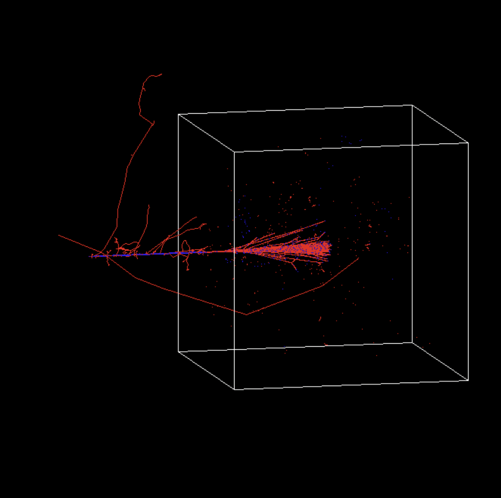
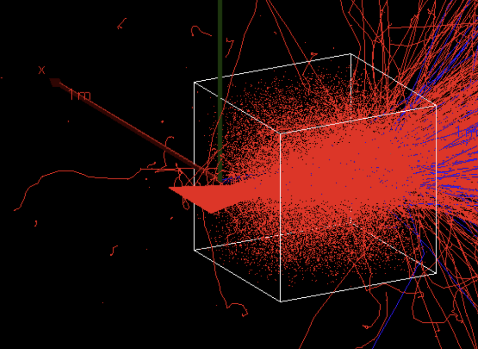

# Symulacje medyczne w programie Geant4

## Spis treści:

- Abstrakt
- Co jest w repozytorium
- Jak korzystać z naszego kodu?
- Treść postera

## Abstrakt

Nasze badania koncentrują się na symulacji działania działka emitującego wysokoenergetyczne cząstki, które skierowane są na fantom wodny. Celem jest dokładne zbadanie, ile energii jest deponowanej przez te cząstki w wodzie na różnych głębokościach. Tego rodzaju badania mają istotne zastosowanie 
w medycynie, szczególnie w terapii nowotworów położonych głęboko w ciele pacjenta. W ramach projektu analizowaliśmy potencjał zastosowania wiązek elektronów w tego typu terapiach.


## Co jest w repozytorium?

- bibliografia ```/bibliography```, której używaliśmy w trakcie projektu
- dane ```/data```, które udało nam się wygenerować dzięki symulacjom
- kod źródłowy symulacji dla Linuxa ```/Linux```i Windowsa ```/Windows```
- skrypty ```/plotters``` do tworzenia wykresów z otrzymanych przez nas danych
- poster```/poster``` oraz inspiracje do niego

## Jak korzystać z naszego kodu?

Wymagania:
- Zainstalowany Geant4 (Najlepiej zbudowany z kodu źródłowego) odsyłamy do [poradnika](https://youtu.be/w7k9PK1Ipv8?si=r0pcr2_cPobGcNrA)
- Zainstalowany CMake
- Zainstalowany Kompilator kodu
- Zainstalowany Python (dla skryptów)

1. Najpierw należy sklonować repozytorium na urządzenie, gdzie chcemy skorzystać z symulacji. Geant4 musi być zainstalowany na tym urządzeniu.
2. Następnie wybieramy folder odpowiadający naszemu systemowi operacyjnemu z pośród: ```/Linux```, ```/Windows```
3. Używając CMake konfigurujemy projekt.
4. Kompilujemy projekt.
5. Skompilowany plik wykonywalny uruchamiamy.

Do uruchomionego programu można wrzucić obecny w repozytorium plik ```vis.mac``` który od razu inicjalizuje wizualizację do symulacji.

## Treść postera

### Abstrakt

Nasze badania koncentrują się na symulacji działania działka emitującego wysokoenergetyczne cząstki, które skierowane są na fantom wodny. Celem jest dokładne zbadanie, ile energii jest deponowanej przez te cząstki w wodzie na różnych głębokościach. Tego rodzaju badania mają istotne zastosowanie 
w medycynie, szczególnie w leczeniu nowotworów położonych głęboko w ciele pacjenta. W ramach projektu analizowaliśmy potencjał zastosowania wiązek elektronów w tego typu terapiach.

### Metoda

Przeanalizowaliśmy układ o wymiarach 1x1x1 m, w którym umieszczono fantom wodny o wymiarach 0,5x0,5x0,5 m. W stronę tego fantomu skierowaliśmy emiter cząstek, generujący idealnie skolimowaną wiązkę cząstek (1). Następnie zmierzyliśmy ilość energii zdeponowanej przez cząstki (zarówno pierwotne, jak i wtórne) na różnych głębokościach fantomu, a wyniki przedstawiliśmy na wykresach.



W pierwszej fazie eksperymentu, w kierunku fantomu wystrzeliwane były protony. Wykres przedstawiający zależność depozycji energii od głębokości fantomu został zaprezentowany na wykresie powyżej (2) dla czterech różnych energii początkowych protonów.


W kolejnej fazie zasymulowaliśmy analogiczny scenariusz z wykorzystaniem wiązki elektronów (3).


Ostatecznym celem projektu było zasymulowanie charakterystyk podobnych do krzywych Bragga, wykorzystując skupione wiązki elektronów.

### Obserwacje i wnioski

Nasze symulacje wykazały wyraźnie korzystne i powtarzalne kształty krzywych depozycji energii dla protonów, a także ich odpowiedniki w symulacjach z elektronami. W miarę postępu projektu stopniowo zwiększaliśmy realizm symulacji poprzez uwzględnienie różnych efektów, takich jak nieidealna kolimacja wiązki oraz obecność powietrza w układzie. Dodatkowo, wykorzystaliśmy wbudowane w Geant4 narzędzia wizualizacyjne do analizy przestrzennej depozycji energii w układzie. Wyniki potwierdziły istnienie wąskiego zakresu głębokości, w którym depozycja energii jest największa, co ma kluczowe znaczenie dla zastosowań medycznych.



(4) Zgodnie z literaturą, skupione wiązki elektronów powinny generować krzywe depozycji energii zbliżone do krzywych Bragga obserwowanych dla protonów. Jednakże w naszych symulacjach nie zaobserwowaliśmy takiego efektu, gdyż symulowane skupienie elektronów przyniosło wyniki zbliżone do tych uzyskanych bez skupienia. W celu poprawy wyników planujemy wdrożenie bardziej precyzyjnych i szczegółowych metod symulacyjnych.

### Podsumowanie

W naszych symulacjach zaobserwowaliśmy charakterystyczne dla depozycji energii krzywe Bragga, co potwierdza, korzystne efekty płynące z depozycji energii przez skupione wiązki protonów. Niestety, nie udało nam się uzyskać oczekiwanych wyników w symulacjach związanych z depozycją energii przez skupione wiązki elektronów. Ten aspekt będzie stanowił kolejny etap naszego projektu, który planujemy rozwijać we współpracy z naszym mentorem.

### Bibliografia

Bibliografia:
- (1) Bagli, E., Asai, M., Brandt, D., Dotti, A., Guidi, V. i Wright, D.H., 2014. A model for the interaction of high-energy particles in straight and bent crystals implemented in Geant4. The European Physical Journal C, 74, p.2996. DOI: https://doi.org/10.1140/epjc/s10052-014-2996-y.

- (2) Kokurewicz, K., Brunetti, E., Curcio, A., Gamba, D., Garolfi, L., Gilardi, A., Senes, E., Sjobak, K.N., Farabolini, W., Corsini, R. i Jaroszynski, D.A., 2021. An experimental study of focused very high energy electron beams for radiotherapy. Communications Physics, 4, p. 236. DOI: https://doi.org/10.1038/s42005-021-00536-0.
